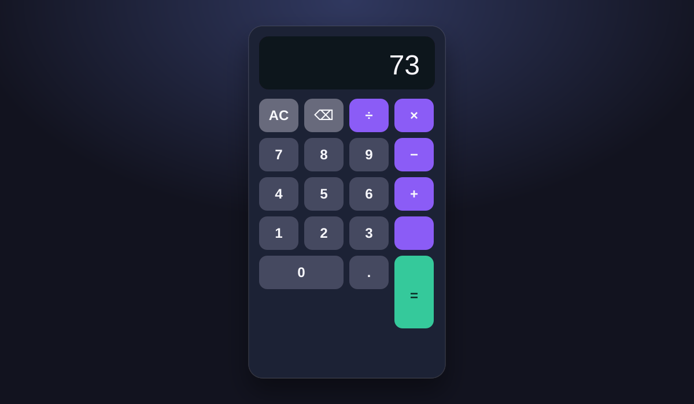

# Calculator

A responsive browser calculator built with plain HTML, CSS, and JavaScript.

## Try it locally

Open `index.html` in any modern browser.

## Features

- Multi-digit and decimal number entry
- Addition, subtraction, multiplication, and division
- Clear and backspace controls
- Division-by-zero handling
- Keyboard support: number keys, `.`, `+`, `-`, `*`, `/`, Enter, Escape, and Backspace
- Responsive layout for phones and desktops

## Screenshot

